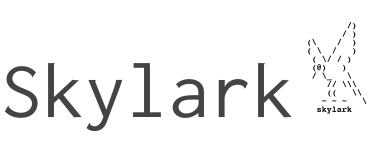

artworks
========

Artworks for each my project on Github.

Usage
------

**requirements**:

- docopt
- wkhtmltoimage
- sass

```bash
Usage:
scripy.py <art.txt> [<name>] [--width=<width>]
```

Sample
------

```
        /)
       / )
(\    /  )
( \  /   )
 ( \/ / )
 (@)   )
 / \_   \
    // \\\
    ((   \\
   ~ ~ ~   \
  skylark
```


